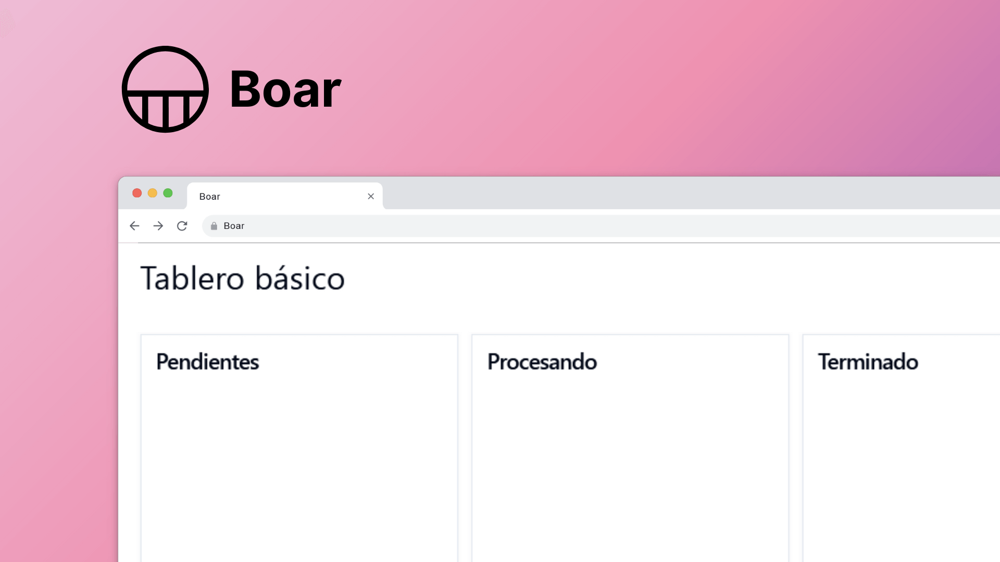

# ⚡ ¿Que es Boar?

Boar es una es una aplicación web desarrollada con React para organizar tareas que puede adaptarse a la forma de trabajo del usuario mejorando su rendimiento a travéz de un tablero de tareas, un panel de configuración y un archivo para guardar las tareas terminadas.



Alpha: [https://cm-boar.netlify.app/](https://cm-boar.netlify.app/)

## 🔥 Características

Para iniciar el desarrollo del proyecto escribí una lista de características esenciales junto con su descripción, luego comencé a seguir un flujo de integración continua, programando características,  pruebas unitarias para reducir errores y documentando ciertos aspectos del proyecto.

Características principales:

* Crear tareas.
* Mover las tareas entre columnas.
* Eliminar las tareas.
* Crear nuevas columnas.
* Eliminar columnas. 
* Archivar las tareas terminadas. 

Boar actualmente cuenta con 12 características y su desarrollo se llevó a cabo durante 10 meses donde no solo programe su funcionamiento sino también diseñe su estructura, interfaz gráfica, pruebas y usabilidad.

## 📖 Documentación

Puedes leer la documentación de Boar en la carpeta [docs](./docs/).

## 🧬 Ejecución local para desarrollo

Para ejecutar Boar localmente luego de clonar el repositorio puedes ejecutar los siguientes comandos:

```bash
npm i
```

```bash
npm run dev
```
