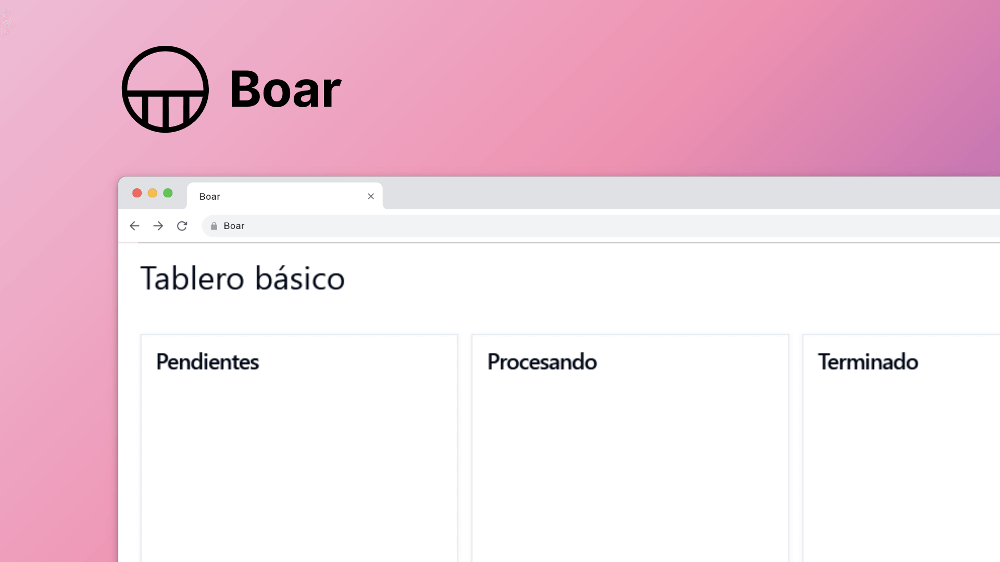

# Capo
<p align="center"><b>Un tablero personal para organizarte sin distracciones.</b></p>
<p align="center">
    <a href="https://github.com/CiroMirkin/Boar/stargazers"></a><a href="https://cm-boar.netlify.app/"></a><a href="https://github.com/CiroMirkin/Boar/blob/main/LICENSE"></a>
</p>


## 🎯 Problematica e Impacto

En entornos de alta carga mental, la fragmentación de la información reduce la productividad. Capo nace para centralizar el flujo de trabajo (tablero), la memoria a largo plazo (notas) y la auditoría de rendimiento (registro de uso) en una sola interfaz cohesiva.




### Impacto clave de Capo:

* **Reducción de Fatiga Visual:** Interfaz minimalista con temas adaptativos.
* **Trazabilidad Total:** Sistema de archivo con exportación PDF/JSON para auditorías de productividad.
* **Consistencia de Datos:** Arquitectura híbrida (Local-First/Cloud) que garantiza disponibilidad sin conexión.

## 🧬 Stack Tecnológico

* Core: React 18 + TypeScript (Tipado estricto para reducir errores en runtime). 
* Tooling: Vite + i18next (Internacionalización automática por idioma del SO).
* Styling: Tailwind CSS + Shadcn/ui (Sistemas de diseño consistentes).
* Backend & Auth: Supabase (PostgreSQL con políticas RLS para seguridad a nivel de fila).
* Testing: Playwright (E2E) para flujos críticos y Vitest para lógica de dominio.

## 🔥 Capacidades del Sistema (KPIs Técnicos)

|**Característica**|**Límite / Regla de Negocio**|**Impacto**|
|---|---|---|
|**Multi-tenancy**|Hasta 5 tableros independientes por usuario|Segmentación de proyectos.|
|**Escalabilidad Horizontal**|Máximo 6 columnas por tablero|Previene la sobrecarga cognitiva (Ley de Miller).|
|**Integridad de Datos**|Notas de hasta 10,000 caracteres|Permite documentación técnica extensa por tablero.|
|**Auditoría**|Archivo histórico de 60 días|Control de calidad y retrospectivas.|

## 🧬 Ejecución y Desarrollo

Instalación:

La app vive en `web-app/` (la documentación en `docs/`).

```
cd web-app

# Instalar dependencias
npm install

# Iniciar entorno de desarrollo
npm run dev
```

Ejecución de Test:

```
# Tests Unitarios
npm run test:unit

# Tests E2E (Playwright)
npx playwright test
```

## 📖 Documentación

Puedes leer la documentación completa dentro de las [wikis](https://github.com/CiroMirkin/Boar/wiki) del repositorio.

## 🛡️ Seguridad (RLS)

El acceso a los datos está protegido mediante Row Level Security en PostgreSQL. Un usuario solo puede interactuar con sus propios UUIDs, garantizando privacidad total entre cuentas.

# Estadisticas


## Licencia

Licenciado bajo la [licencia MIT](https://github.com/CiroMirkin/Boar/blob/main/LICENSE).