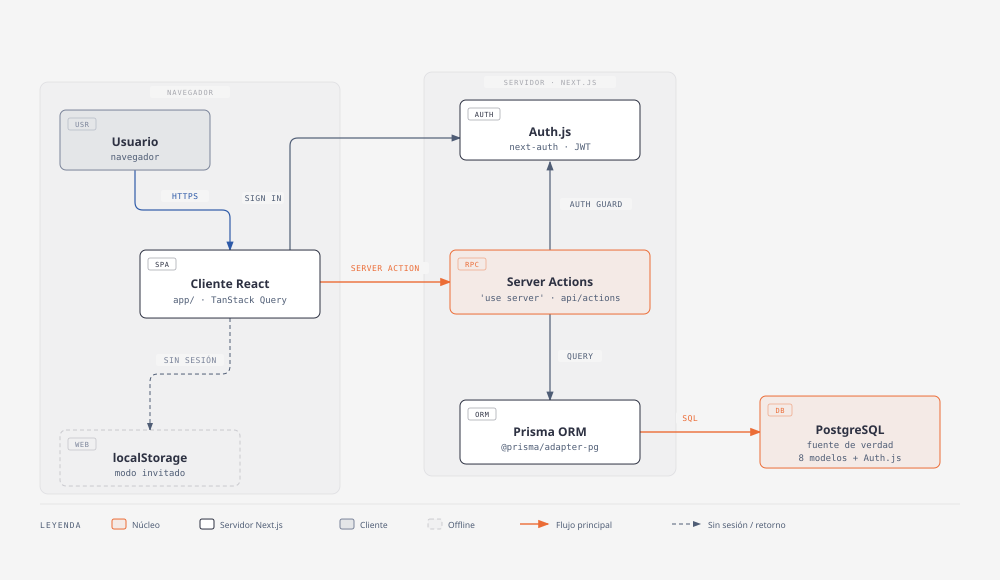
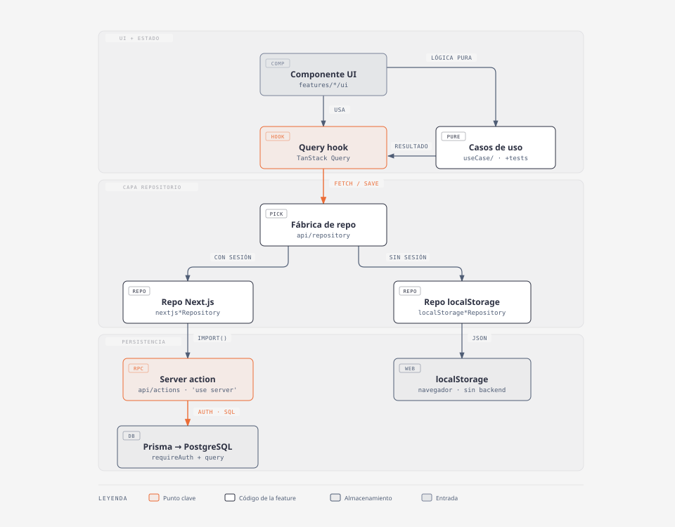

# Arquitectura

Capo es una **app Next.js (App Router)** que funciona con o sin backend: con
sesión persiste en PostgreSQL vía server actions + Prisma; sin sesión guarda
todo en `localStorage`. El código de la app vive en `web-app/`; esta carpeta
`docs/` está en la raíz del repo.

Los diagramas siguen el modelo [C4](https://c4model.com/): contexto →
contenedores → componentes, más el modelo de datos.

---

## 1. Contexto

| Elemento | Rol |
|----------|-----|
| **Usuario** | Gestiona tableros, tareas, notas, etiquetas y recordatorios desde el navegador. |
| **Capo** | App Next.js 15 (React 18). Renderiza el cliente, expone server actions y route handlers. |
| **PostgreSQL** | Base de datos de la sesión autenticada. Único almacén compartido. |
| **Auth.js** | Login por email/contraseña (bcrypt) o GitHub OAuth. Sesión JWT. |
| **localStorage** | Almacén local del navegador para el modo invitado (sin login). |

Sin credenciales de base de datos configuradas la app sigue corriendo: el
middleware manda a `/board/1` y toda la persistencia cae en `localStorage`.

---

## 2. Contenedores

Qué proceso corre dónde y cómo se hablan entre sí.



- **Cliente React** (`web-app/app`, `web-app/src/features/*/ui`) — componentes
  cliente, estado de servidor con TanStack Query, i18n, tema.
- **Server Actions** (`features/*/api/actions`, `'use server'`) — el punto de
  entrada al backend. Cada action valida sesión y pertenencia con las guardas
  de `src/shared/lib/serverAuth.ts` (`requireAuth`, `requireBoardAccess`,
  `requireColumnAccess`, `requireTaskAccess`) antes de tocar la base.
- **Route Handlers** — `POST /api/auth/register` (alta con rate-limit) y
  `/api/auth/[...nextauth]` (handler de Auth.js).
- **Prisma ORM** — cliente generado en `web-app/generated/prisma`, adaptador
  `@prisma/adapter-pg` sobre `pg`.
- **PostgreSQL** — 8 modelos de dominio + 3 tablas que exige Auth.js.

### Rutas (`web-app/app`)

| Ruta | Pantalla |
|------|----------|
| `/` | Dashboard multi-tablero (redirige a `/board/1` si no hay sesión) |
| `/board/[id]` | Tablero: columnas, tareas, vistas LIST / BOARD / NOTE-LIST |
| `/archive/[id]` | Archivo de tareas y notas archivadas |
| `/time/[id]` | Registro de uso por sesiones |
| `/settings`, `/settings/[id]` | Preferencias de usuario y de tablero |
| `/auth/[[...id]]` | Login / registro |
| `/help` | Ayuda |

---

## 3. Componentes — anatomía de una feature

Todo `src/features/<feature>/` es autocontenido y sigue la misma forma:

```
features/tasks/
├── api/
│   ├── actions/      # server actions ('use server') — hablan con Prisma
│   └── repository/    # fábrica + impl Next.js + impl localStorage
├── hooks/            # hooks de TanStack Query (queries + mutations)
├── model/            # tipos + funciones de dominio
├── ui/               # componentes React de la feature
├── useCase/          # lógica de negocio en funciones puras (con tests)
├── state/            # store Zustand (opcional)
└── index.ts          # API pública de la feature
```

El patrón central es el **repositorio dual**: el hook no sabe si hay backend.
Una fábrica elige la implementación según haya sesión.



- **Query hook** — expone `data` + mutaciones con actualización optimista y
  rollback. Es lo único que consume la UI.
- **Casos de uso** (`useCase/`) — transformaciones puras del estado
  (`addNewTaskColumn`, `changeStatusName`, `moveTask`, …), testeadas con Vitest,
  sin dependencias de React ni de red.
- **Fábrica de repositorio** — `if (session) → repo Next.js` (import dinámico
  de la server action) `else → repo localStorage` (JSON en el navegador).
- **Server action** — valida y ejecuta la query de Prisma.

> **Excepción:** la feature `dashboard` no tiene capa `repository`; sus hooks
> llaman las server actions directamente (`getBoards`, `createBoard`,
> `deleteBoard`). Es el único caso donde nunca hace falta el modo offline.

### Compartido (`src/shared`)

| Carpeta | Contenido |
|---------|-----------|
| `lib/` | `prisma`, `serverAuth`, `rateLimit`, `formatDate` / `formatTime`, `utils` |
| `errors/` | `BusinessError` + traducción de errores para el usuario |
| `hooks/` | `useLocalStorage`, `useIsHydrated`, `useMediaQuery`, `useTheme`, … |
| `i18n/` | i18next ES / EN (cliente y servidor) |
| `preferences/` | `theme` (claro/oscuro/sistema), `language`, `view-mode` |
| `ui/` | Design system atómico: `atoms` → `molecules` → `organisms` (incl. editor Tiptap) |

### Montaje (`app/layout.tsx` → `app/providers.tsx`)

```
RootLayout
└── Providers
    └── SessionProvider              # contexto de sesión Auth.js
        └── QueryClientProvider      # TanStack Query
            └── AppInit
                ├── ThemeProvider    # tema desde localStorage ('boar-theme')
                ├── ClientOnlyInit   # useSaveTimeTracking · i18n del usuario
                └── children + <Toaster/>  (sonner)
```

Estado global con Zustand solo donde hace falta cruzar el árbol: `board_id`
activo (`features/auth/state`), grupo de etiquetas y recordatorio en edición.

---

## 4. Modelo de datos

El esquema Prisma y su diagrama ER están en **[modelo-datos.md](./modelo-datos.md)**.

---

## 5. Herramientas

| Área | Stack |
|------|-------|
| Framework | Next.js 15 (App Router), React 18, TypeScript |
| Datos | Prisma 7 + `@prisma/adapter-pg`, PostgreSQL |
| Auth | Auth.js v5 (`next-auth` beta), Credentials + GitHub, JWT |
| Estado de servidor | TanStack Query |
| Estado de cliente | Zustand (puntual) |
| UI | Radix UI, Tailwind, `lucide-react`, Tiptap (rich text) |
| i18n | i18next / react-i18next (ES · EN) |
| Tests | Vitest (unit), Playwright (e2e: Chromium + Firefox) |

### Regenerar los diagramas

Fuente: los `.html` en `docs/diagramas/`, hechos con la skill `diagram-design`.
El `.svg` embebido en este doc es el bloque `<svg>` de cada `.html` con el
`@import` de fuentes inyectado. Tras editar un `.html`, volver a exportar su
`.svg`.
