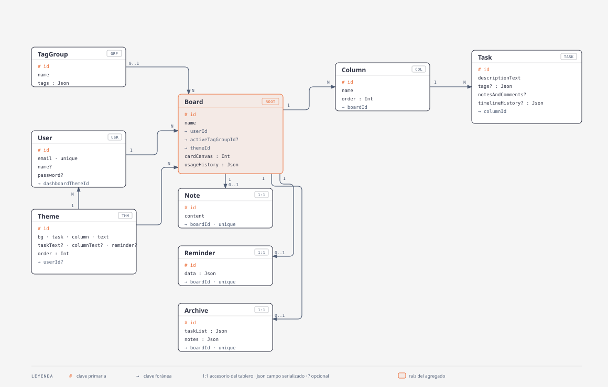

# Modelo de datos

Esquema Prisma (`web-app/prisma/schema.prisma`), provider `postgresql`.

- **`Board`** es la raíz del agregado: todo cuelga de un tablero y se borra en
  cascada con él.
- **`Note`**, **`Reminder`** y **`Archive`** son accesorios 1:1 del tablero
  (`boardId` único).
- **`TagGroup`** es compartible: muchos tableros pueden tener el mismo grupo
  como activo (`activeTagGroupId`).
- **`Theme`** es el catálogo de temas de color, seeded desde `prisma/seed.ts`
  (`upsert` por `id`). `userId` nullable: `null` = tema integrado, seteado =
  tema del usuario (a futuro). Lo referencian `Board.themeId` y
  `User.dashboardThemeId` (FK, default `"retro"`) — cada tablero tiene su tema y
  el dashboard el suyo.
- **`Board.cardCanvas`** (`Int`) es el índice del patrón de fondo de la card en
  el dashboard; se asigna al azar al crear el tablero y se puede cambiar.
- Campos `Json` (`tags`, `timelineHistory`, `usageHistory`, `taskList`, …)
  guardan estructuras que no necesitan consultarse por separado.
- `Account`, `Session` y `VerificationToken` son las tablas que pide el
  `PrismaAdapter` de Auth.js (no se dibujan).

El modo invitado replica estas mismas formas en `localStorage`, una clave por
feature. Excepción: el tema es uno solo y global (`boar-theme`), no hay tema por
tablero ni catálogo para invitados.

---

## Cómo se llega a estos datos

El acceso siempre pasa por una server action que valida sesión y pertenencia
antes de tocar la base — ver [arquitectura.md](./arquitectura.md) (§2
Contenedores y §3 Componentes) para el patrón de repositorio dual y las
guardas de `serverAuth.ts`.

## Regenerar el diagrama

Fuente: `docs/diagramas/modelo-datos.html`, hecho con la skill `diagram-design`.
El `.svg` embebido es su bloque `<svg>` con el `@import` de fuentes inyectado.
Tras editar el `.html`, volver a exportar el `.svg`.
